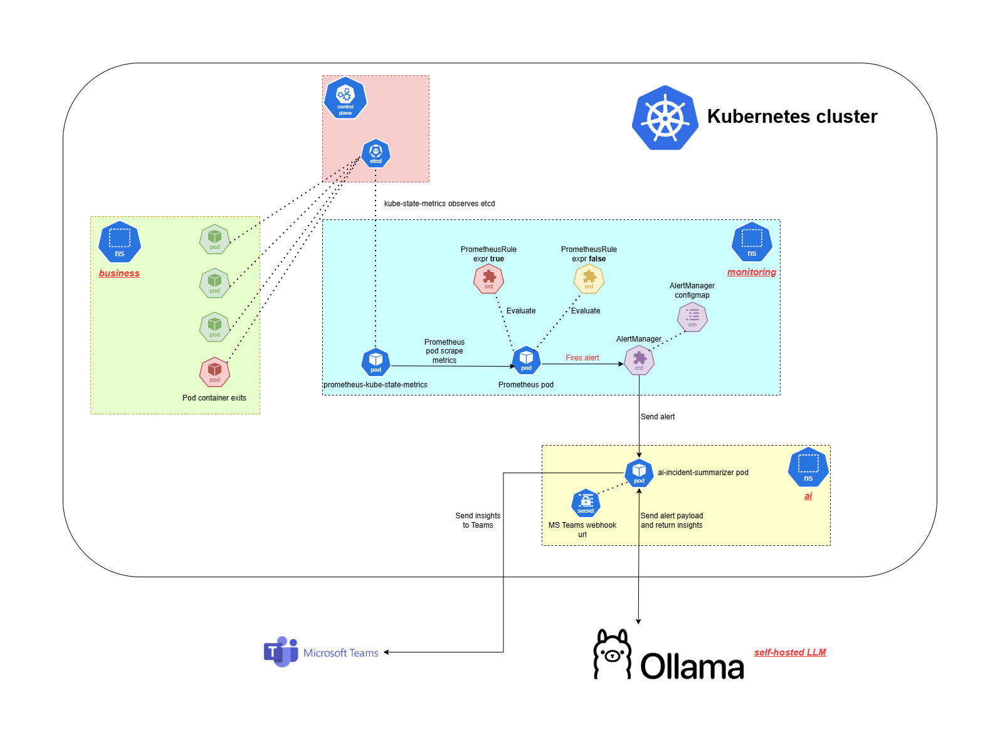
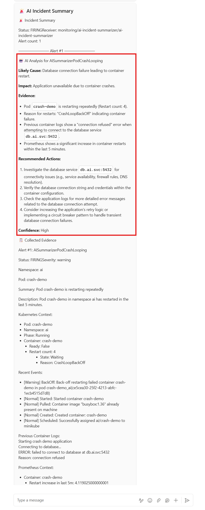
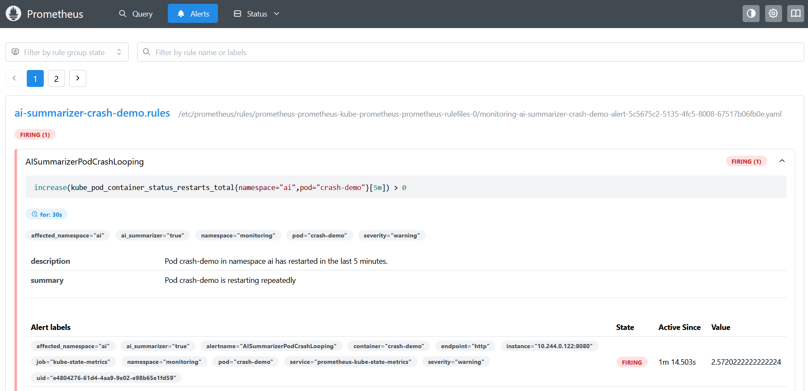

# AI Assisted Kubernetes Incident Summarizer

## Overview

Kubernetes alerts often lack sufficient context for rapid diagnosis. This service automatically enriches selected Prometheus alerts with
   * Kubernetes pod state
   * recent events
   * previous container logs
   * relevant metrics<br>

It then uses a locally hosted large language model to generate structured incident analysis and sends the result to Microsoft Teams. 


## Architecture and workflow



1. An application container repeatedly exits and is restarted by Kubernetes.
2. `kube-state-metrics` exposes the container restart count.
3. Prometheus evaluates the configured alert rule, defined in the `PrometheusRule` CRD.
4. Prometheus sends the firing alert to `Alertmanager`.
5. Alertmanager routes opted-in alerts to the `ai-incident-summarizer` application.
6. The `ai-incident-summarizer` application retrieves Kubernetes events, pod status, previous logs, and relevant Prometheus metrics.
7. The collected evidence is sent to the self-hosted `Ollama` model outside of the Kubernetes cluster, which enriches the evidence.
8. The generated incident analysis is delivered to `Microsoft Teams`.

<br>

****

<br>

## End result and sample output
<br>



**Likely Cause**: Database connection failure leading to container restart.<br>
**Impact**: Application unavailable due to container crashes.<br>
**Evidence**:
* Pod crash-demo is restarting repeatedly (Restart count: 4).
* Reason for restarts: "CrashLoopBackOff" indicating container failure.
* Previous container logs show a "connection refused" error when attempting to connect to the database service `db.ai.svc:5432`.
* Prometheus shows a significant increase in container restarts within the last 5 minutes.<br>

**Recommended Actions**:
1. Investigate the database service db.ai.svc:5432 for connectivity issues (e.g., service availability, firewall rules, DNS resolution).
2. Verify the database connection string and credentials within the container configuration.
3. Check the application logs for more detailed error messages related to the database connection attempt.
4. Consider increasing the application's retry logic or implementing a circuit breaker pattern to handle transient database connection failures.

**Confidence**: High

## Key capabilities

* Receives Alertmanager webhooks through FastAPI
* Filters AI-enabled alerts using the `ai-summarizer: true` label.
* Retrieves pod status, container restart counts, recent events and previous container logs.
* Queries Prometheus for supporting time-series evidence.
* Generates structured analysis using an Ollama-hosted LLM.
* Sends incident summaries to Microsoft Teams.
* Uses read-only Kubernetes RBAC.
* Continues processing with partial results when optional dependencies failed.

# Quick Start

**Prerequisites**

* Docker
* Kubernetes cluster (Minikube is used here)
* kubectl
* Python 3.12
* Helm
* kube-prometheus-stack
* Ollama and a downloaded model
* Microsoft Teams Workflow webhook


```bash
# Clone the repository
git clone git@github.com:minghui1994/kubernetes-ai-incident-summarizer.git
cd kubernetes-ai-incident-summarizer

# Create a python virtual env and install requirements
python -m venv .venv
source .venv/bin/activate
pip install -r requirements.txt

# Run the test cases (optional)
pytest

# Containerize the ai-incident-summarizer application
docker build -t ai-incident-summarizer:latest .
# Load the image into minikube so the pod will be able to pull the image
minikube image load ai-incident-summarizer:latest

# Apply kubernetes manifests
kubectl apply -f k8s/namespace.yaml
kubectl apply -f k8s/rbac/rbac.yaml
kubectl apply -f k8s/service.yaml
kubectl apply -f k8s/deployment.yaml
kubectl apply -f k8s/alertmanagerconfig.yaml

# Create a secret for the Teams webhook url
kubectl create secret generic ai-incident-summarizer-secret -n ai \
  --from-literal=TEAMS_WEBHOOK_URL='https://your-teams-webhook-url-here'
```

<br>

# Limitations and Roadmap

## Current limitations

* Only pod-based alerts are currently enriched.
* In a multi-container pod, only the first container is selected.
* Processes alerts synchronously.
* No webhook authentication yet.
* Ollama endpoint is assumed to be trusted.
* Microsoft Teams is the only notification target.
* Resolved alerts do not yet produce a dedicated recovery message.
* The current deployment configuration is designed for Minikube.
* Alert processing state is not persisted. Alert-processing history and delivery status are not stored in a persistent database, so processing records are lost when the service starts. 
  * Application does not keep a database or persistent record containing things such as
    * which alert fingerprints were processed
    * when they were processed
    * whether Ollama succeeded
    * whether the Teams message was delivered
    * what summary was generated
    * how many processing attempted occurred
* Duplicate Alertmanager deliveries are not deduplicated and can send the same alert more than once. May be due to
  * alert remains firing and Alertmanager sends another notification after its repeat interval
  * Alertmanager retries because due to webhook timed out or returned an error
  * the service completed the work but Alertmanager did not receive the successful response
  * the same alert appears again 
* The service currently targets CrashLoopBackOff and container-restart scenarios.

## Future plans and improvements

* Select the affected container in multi-containers pod.
* Generate dedicated resolved-alert messages.
* Deduplicate alerts using Alertmanager fingerprints.
* Process incidents asynchronously using a worker queue.
* Add support for Deployment, StatefulSet, and Node incidents.
* Expose Prometheus metrics for the summarizer.
* Support additional notification channels, not just Microsoft Teams.
* Manage deployment through FluxCD and protect secrets with Sealed Secrets.

# Demo

## 1. Create a pod which crashes

```yaml
apiVersion: v1
kind: Pod
metadata:
  name: crash-demo
  namespace: ai
  labels:
    app: crash-demo
spec:
  containers:
    - name: crash-demo
      image: busybox:1.36
      command:
        - sh
        - -c
        - |
          echo "Starting crash demo application"
          echo "Connecting to database..."
          echo "ERROR: failed to connect to database at db.ai.svc:5432"
          echo "Reason: connection refused"
          sleep 5
          exit 1
  restartPolicy: Always
```

## 2. Create a PrometheusRule for this crash demo

```yaml
apiVersion: monitoring.coreos.com/v1
kind: PrometheusRule
metadata:
  name: ai-summarizer-crash-demo-alert
  namespace: monitoring
  labels:
    release: prometheus
spec:
  groups:
    - name: ai-summarizer-crash-demo.rules
      rules:
        - alert: AISummarizerPodCrashLooping
          expr: increase(kube_pod_container_status_restarts_total{namespace="ai", pod="crash-demo"}[5m]) > 0
          for: 30s
          labels:
            severity: warning
            ai_summarizer: "true"
            namespace: monitoring  # For AlertmanagerConfig namespace matching
            affected_namespace: ai  # Tells our summarizer the actual affected workload is in the ai namespace
            pod: crash-demo
          annotations:
            summary: "Pod crash-demo is restarting repeatedly"
            description: "Pod crash-demo in namespace ai has restarted in the last 5 minutes."
```

## 3. Check if alert is firing

```bash
kubectl port-forward service/prometheus-kube-prometheus-prometheus -n monitoring 9090
```



## 4. Check if you receive the alert workflow card on Teams.

